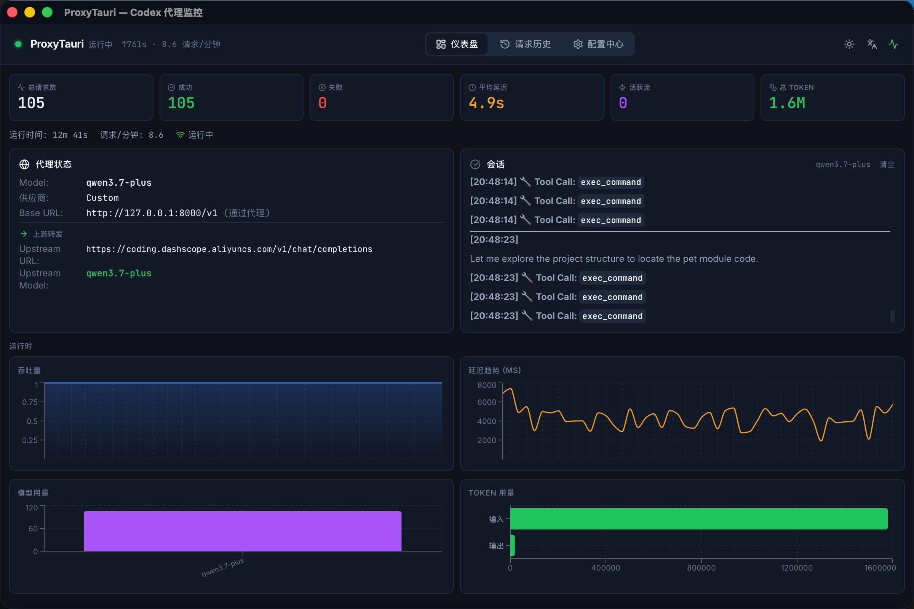

# ProxyTauri

A lightweight desktop application built with Tauri that proxies AI client requests (such as Codex CLI) to any LLM service compatible with the OpenAI Chat Completions API, while providing real-time monitoring, session preview, and configuration management.



## Features

### Protocol Conversion Proxy

- **Responses API → Chat Completions API**: Automatically converts OpenAI Responses API format (used by Codex) to the Chat Completions format supported by upstream LLM services
- **Streaming Support**: Full SSE streaming support with automatic adaptation for both streaming and non-streaming upstreams
- **Tool Call Passthrough**: Converts tool definitions and supports streaming accumulation and forwarding of function calls
- **Multi-Vendor Adaptation**: Built-in model vendor detection with automatic parameter adjustment for different LLM providers (Qwen, DeepSeek, etc.)

### Real-Time Monitoring Dashboard

- **Request Statistics Cards**: Total requests, successes, failures, average latency, active streams, total tokens
- **Throughput Chart**: Real-time request throughput curve (Area Chart)
- **Latency History Chart**: Request latency trend over time (Line Chart)
- **Model Usage Statistics**: Bar chart of model invocation counts
- **Token Distribution Chart**: Input vs. output token usage comparison

### Live Session Preview

- **Markdown Rendering**: Real-time rendering of LLM responses using `react-markdown` + `remark-gfm`, supporting tables, code blocks, lists, and more
- **Tool Call Visualization**: Displays tool call names with icons in the session panel
- **Task Progress Tracking**: Automatically parses Codex task lists (`- [ ]` / `- [x]`) and displays a progress bar with completion percentage
- **Timestamp Markers**: Shows `[HH:MM:SS]` timestamps before each message and tool call
- **Content Accumulation**: Preserves session content across requests with manual clear option
- **Performance Optimization**: 100ms throttled rendering + 4000 character truncation to prevent long-text rendering lag

### Configuration Management

- **Multiple Presets**: Save multiple upstream service configurations (URL, model, API Key) for quick switching
- **Encrypted API Key Storage**: Uses Fernet symmetric encryption to securely store API keys in a SQLite database
- **Connectivity Testing**: One-click upstream connectivity test returning available models and latency
- **Codex Auto-Configuration**: Automatically writes the local proxy address to `~/.codex/config.toml` — no manual setup required

### System Tray

- **Background Operation**: Minimizes to system tray on window close; proxy continues running
- **Status Indicator**: Tray icon reflects proxy running state in real time
- **Cross-Platform**: Supports macOS, Windows, and Linux

## Tech Stack

| Layer | Technology |
|-------|-----------|
| Desktop Framework | Tauri 2.x |
| Frontend | React 19 + TypeScript + Tailwind CSS |
| Charts | Recharts |
| Markdown | react-markdown + remark-gfm |
| Backend Proxy | Rust + axum + reqwest |
| Data Storage | SQLite (rusqlite) |
| Encryption | Fernet |
| Async Runtime | Tokio |

## Getting Started

### Prerequisites

- Rust 1.70+
- Node.js 18+
- npm 9+

### Development Mode

```bash
cd proxy-tauri
npm install
npm run tauri dev
```

### Build Release

```bash
cd proxy-tauri
npm run tauri build
```

Build artifacts are located in `src-tauri/target/release/bundle/`.

## Project Structure

```
proxy-tauri/
├── src/                    # React Frontend
│   ├── pages/              # Page components
│   │   ├── Dashboard.tsx   # Dashboard (stats, charts, session preview)
│   │   ├── Config.tsx      # Configuration center
│   │   └── History.tsx     # Request history
│   ├── contexts/           # React Context providers
│   ├── lib/                # Utilities, types, i18n
│   └── components/         # Shared components
├── src-tauri/              # Rust Backend
│   ├── src/
│   │   ├── lib.rs          # Tauri entry point & command registration
│   │   ├── proxy.rs        # Proxy server core logic
│   │   ├── metrics.rs      # Metrics & session management
│   │   ├── convert.rs      # Protocol conversion (Responses → Chat)
│   │   ├── config.rs       # Config management (Codex integration)
│   │   ├── model.rs        # Model vendor detection & parameter adaptation
│   │   └── sse.rs          # SSE event construction
│   └── Cargo.toml
└── package.json
```

## License

MIT
